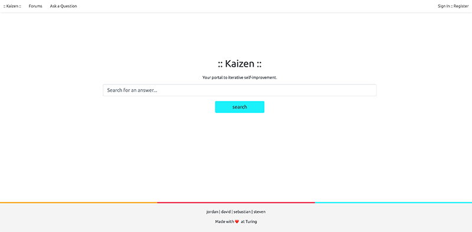

<h1 align=center>Welcome to <a href="https://obscure-journey-59246.herokuapp.com" style="color: #ef3852">Kaizen</a></h1>
<h4 align=center style="color: #f9ae06">Your portal to iterative self-improvement.</h4>

<p align="center">
  
</p>

<p align=center style="color: #343a40">Kaizen, as a word, comes from the Japanese philosophy of improving oneself in any way, big or small. Kaizen, as an application, is built with this philosophy at it's core.</p>

<p align='center'>
  
</p>

# <span style="color: #ef3852">About Kaizen ::</span>

<p style="color: #343a40">Kaizen is an application about community improvement. At it's core, Kaizen seeks to help bridge the gap between students and junior developers breaking in to development and large, professional communities like Stack Overflow. Turing taught us that developer empathy should be at the forfront of developer engagement. As a developer team, we set out to bring empathy to those who may feel intimidated in other spaces. The result? Kaizen.</p>

<p align='center'>
  
</p>

# <span style="color: #ef3852">Table of Contents ::</span>

* <span style="color: #343a40">[Production](#production)</span>
  * <span style="color: #343a40">[Signing Up](#signing-up)</span>
  * <span style="color: #343a40">[Logging In](#logging-in)</span>
  * <span style="color: #343a40">[Search](#search)</span>
  * <span style="color: #343a40">[Post Question](#post-question)</span>
  * <span style="color: #343a40">[Leave a Comment](#leave-a-comment)</span>
  * <span style="color: #343a40">[Answer a Question](#answer-question)</span>
* <span style="color: #343a40">[Development](#development)</span>
  * <span style="color: #343a40">[Versions](#versions)</span>
  * <span style="color: #343a40">[Setup](#setup)</span>


<h2><span style="color: #ef3852">Production</span></h2>
  <p style="color: #343a40">Looking to figure out how to use our production application? Check out the information below.</p>
  
<h3 align='center'><span style="color: #ef3852">Signing Up</span></h3>

<p align='center'>
  
</p>

<h3 align='center'><span style="color: #ef3852">Logging In</span></h3>

<p align='center'>
  
</p>

<h3 align='center'><span style="color: #ef3852">Searching the Application</span></h3>

<p align='center'>
  
</p>

<h3><span style="color: #ef3852">Post Question</span></h3>

<p align='center'>
  
</p>

<h3 align='center'><span style="color: #ef3852">Leave a Comment</span></h3>

<p align='center'>
  
</p>

<h3 align='center'><span style="color: #ef3852">Answer Question</span></h3>

<p align='center'>
  
</p>

<h1><span style="color: #ef3852">Development</span></h1>

<h2><span style="color: #ef3852">Versions</span></h2>

  - Ruby :: [2.7.1](https://www.ruby-lang.org/en/news/2020/03/31/ruby-2-7-1-released)
  - Rails :: [6.0.2.2](https://guides.rubyonrails.org/)
  - Devise :: [4.0](https://github.com/heartcombo/devise)
  - RSpec :: [3.9](https://rspec.info/documentation/)

   
<h2><span style="color: #ef3852">Setup</span></h2>
  
<p>If you are interested in seeing what it looks like under the hood, follow these steps to bring to your local machine.</p>

  * [FORK and CLONE](https://help.github.com/en/github/getting-started-with-github/fork-a-repo) this repository. 

  * Head to your terminal and type the following commands:

    ```
    bundle install
    bundle update
    rails db:{drop,create,migrate,seed}
    ```

  * Want to see it in a local server? Do this:
  
    ```
    rails s
    ```
    Then head to your favorite browser and head to `localhost:3000`

  * Interested in our testing coverage and suite? Do this:

    ```
    bundle exec rspec
    ``` 
 
 
  
